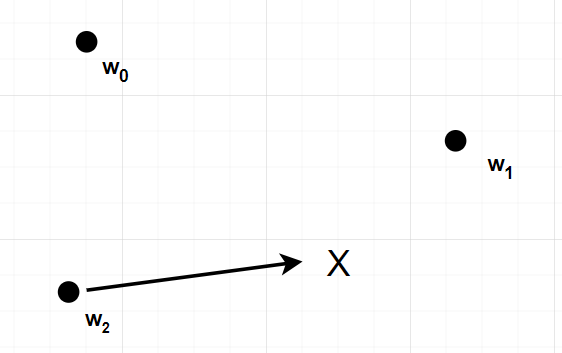

# Regional-and-Online-Learnable-Fields

**"Rolf"** ist ein einfaches **Neuronen-Gas**, das versucht einen Input 
möglichst gut nachzubilden.
  

## Neuronen Model

Jedes Neuron wird durch die folgenden Größen beschrieben.

* **wk** :  Das Gewicht, welches ein  Vektor ist.
* **rk** :  Der Radius

## Algorithmus

Der Algorithmus arbeitet auf die folgende weise.

* 1. Zu beginn wird die Entfernung von allen Neuronen **wk** zum Input **X**
ermittelt. 
  
* 2. Geuscht ist jetzt das Neuron **wk** bei dem der Abstand, zum Input, kleiner als **rho*rk** ist. Wobei **rho** ein Parameter ist der vorher festgelegt wird.
  
* 3. Wird kein Neuron gefunden, so wird der Input **X** zu einem Neuron.
Ansonsten wird das Neuron **wk** in die Richtung von **X** verschoben und der Radius **rk** ebenfalls angepasst.

## Implementierung & Einfaches Beispiel

Zu begin erstellen wir ein **Pythonfile**. In unserem Fall heist es
**QuickStart.py**. In diesem Fügen wir den folgenden Code hinzu

    from RolfNet import *

    ###########  Definition Model ###########

    Neurons={    }
    rho=1
    etac, etas=0.1,0.005
    Nrun=100
    info="""

    Test model to check workflow

    """

* **Neurons** ist ein Dictonary aus den Neuronen.
* **Nrun** ist die Anzahl an Trainingsdurchläufen
* **etac,etas** ist die Lernrate

Als nächstes definieren wir die Trainingsbeispiele.

    ########    Data to Train ###########

    #  Represent the logic AND

    Sampels=[
            [0,0,0],
            [1,1,1],
            [1,0,0],
            [0,1,0]
        ]

Die obigen Beispile entsprechen einem logischen **AND** .
  

Das Training erfolgt mit dem Code.

    ########  Train Model #####

    TrainModell(Neurons, Sampels, rho, etac, etas, Nrun )

Zum Schluss bleibt nur noch das Speichern des Trainierten Models.

    ###########Save Model###########################
    
    file="TestModel.pkl"
    StoreModel(Neurons, rho,etac, etas,Nrun,info, file)

Modele werden in dem **.pkl** format abgespeichert.

## Prediction

Eine Vorherage kann mit unserem Trainierten Model auf die 
folgende weise gemacht werden

    ######## Load Model #############

    Model=LoadModel("TestModel.pkl")
    x=[1,1,None]

    print(MakePrediction(Model,x) )

Zu beginn laden wir das Model. Anschließend legen wir den Input vektor fest **x** fest. Die Größen, welche wir nicht kennen werden mit **None** belegt.
  
Die Vorhersage funktion sucht das beste Neuron, das zum dem Input **x** passt. 
  
**Die Ausgabe ist:**

    [1.0, 1.0, 1.0]

## Litratur

 **David Kriesel ; Ein kleiner überblick über Neuronale Netze ; 2005** 